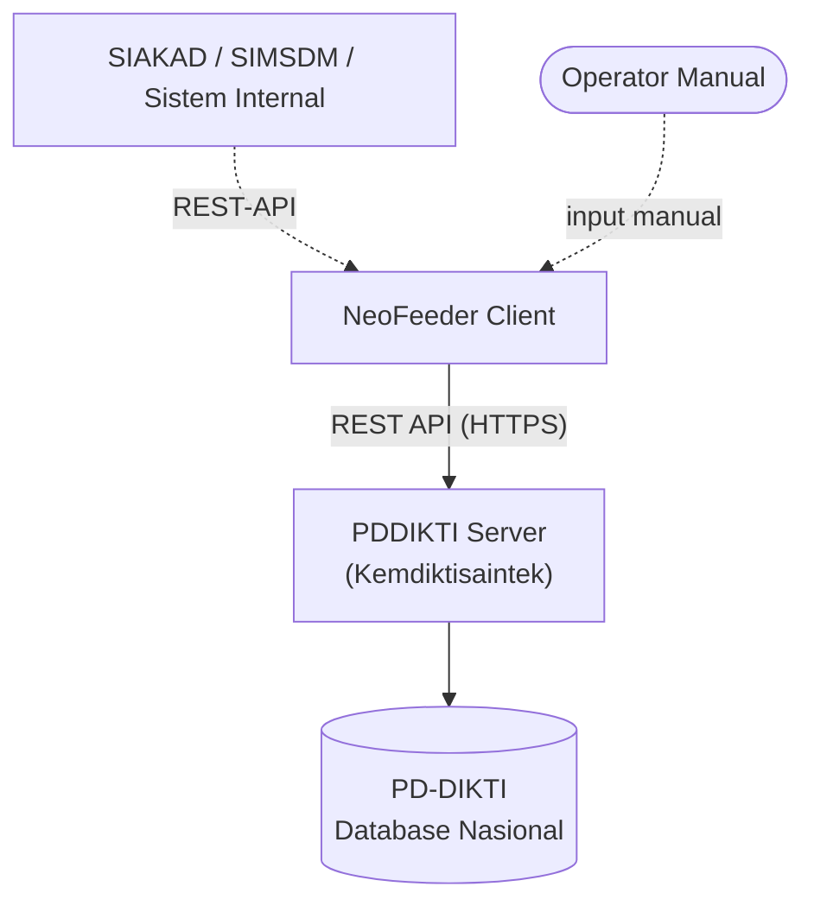
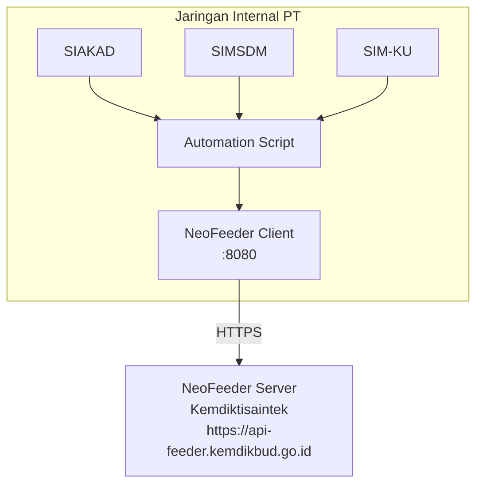
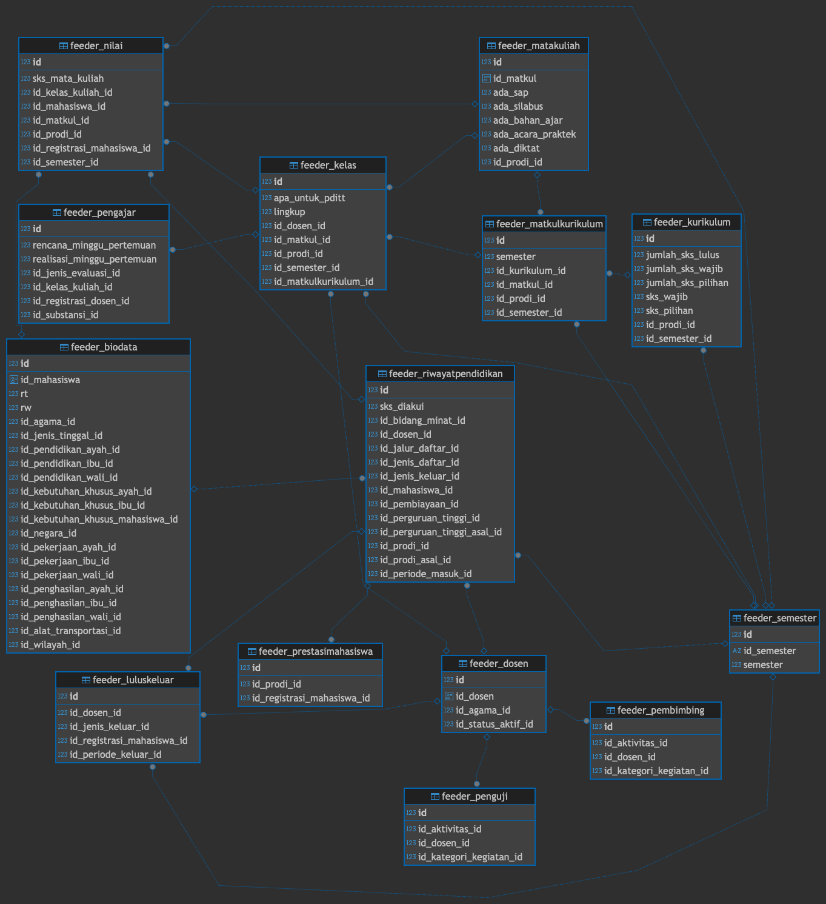
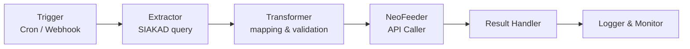

# Pelaporan PD-DIKTI dengan NeoFeeder Terotomatisasi via Web Service

---

## Daftar Isi

1. [Pengantar PD-DIKTI & NeoFeeder](#1-pengantar-pd-dikti--neofeeder)
2. [Arsitektur Sistem](#2-arsitektur-sistem)
3. [Web Service API](#3-web-service-api)
4. [Entitas Data](#4-entitas-data)
5. [Strategi Otomatisasi](#5-strategi-otomatisasi)
6. [Implementasi (Python)](#6-implementasi-python)
7. [Best Practice & Troubleshooting](#7-best-practice--troubleshooting)

---

## 1. Pengantar PD-DIKTI & NeoFeeder

### Apa itu PD-DIKTI?

**Pangkalan Data Pendidikan Tinggi (PD-DIKTI)** adalah sistem basis data nasional yang dikelola oleh Kemdiktisaintek untuk menghimpun seluruh data penyelenggaraan pendidikan tinggi di Indonesia. Data ini menjadi acuan resmi untuk akreditasi, hibah, beasiswa, dan berbagai kebijakan pendidikan tinggi.

> **Kewajiban Pelaporan**
> Berdasarkan UU No. 12 Tahun 2012 dan Permenristekdikti No. 61 Tahun 2016, setiap perguruan tinggi **wajib** melaporkan data penyelenggaraan pendidikan ke PD-DIKTI secara berkala (tiap semester). Ketidakpatuhan berdampak pada status akreditasi dan eligibilitas hibah.

---

### Evolusi Feeder: Dari Lama ke NeoFeeder

| Aspek | Feeder Lama | NeoFeeder |
|---|---|---|
| Protokol | SOAP/XML | REST/JSON |
| Autentikasi | Username + Password | Token-based (JWT) |
| Antarmuka | Desktop App | Web-based + API |
| Integrasi | Manual / terbatas | Full API automation |
| Validasi | Post-submit | Real-time |
| Error Handling | Minimal | Structured error response |
| Update | Manual install | Otomatis via web |

---

### Posisi NeoFeeder dalam Ekosistem

NeoFeeder bukan sekadar pengganti feeder lama — ia adalah **platform integrasi**. Perguruan tinggi dapat menghubungkan SIAKAD, SIMSDM, dan sistem internal lainnya langsung ke PD-DIKTI tanpa antarmuka manual, selama menggunakan web service yang disediakan.



---

## 2. Arsitektur Sistem

### Komponen Utama

| Komponen | Peran |
|---|---|
| **PDDIKTI Server** | Server pusat milik Kemdiktisaintek. Menyimpan data master dan menerima kiriman data dari PT. |
| **NeoFeeder Client** | Aplikasi lokal di PT (web-based). Berfungsi sebagai gateway antara SIAKAD dan server pusat. |
| **Web Service Layer** | REST API endpoint yang diekspos oleh NeoFeeder Client. Titik integrasi untuk otomatisasi. |
| **Local Database** | Database lokal NeoFeeder (MySQL/MariaDB) sebagai buffer sebelum data dikirim ke server pusat. |

---

### Topologi Deployment



---

### Protokol Komunikasi

| Layer | Teknologi | Keterangan |
|---|---|---|
| Transport | HTTPS | TLS 1.2+ wajib |
| Format Data | JSON | UTF-8 encoding |
| HTTP Method | POST | Semua fungsi menggunakan POST |
| Autentikasi | Bearer Token | Masukkan pada body request, bukan header |

> **💡 Catatan**
> NeoFeeder Client berfungsi sebagai **proxy lokal**. Saat kita memanggil web service, kita memanggil endpoint NeoFeeder Client lokal — bukan langsung ke server Kemdiktisaintek. Posting dan get data dari server PDDIKTI melalui proses singkronisasi.

---

## 3. Web Service API

### Struktur Request

Semua fungsi dipanggil ke satu endpoint dengan parameter `act` yang menentukan fungsi yang dipanggil.

```json
// Base URL
POST http://localhost:8080/ws/
Content-Type: application/json

// Body umum
{
  "act": "NamaFungsi",
  "token": "TOKEN_DARI_GetToken",
  "filter": "{sql-filter}",
  "order": "{sql-order}",
  "limit": 100,
  "offset": 0
}
```

---

### Autentikasi — GetToken

Langkah pertama sebelum memanggil fungsi apapun:

```json
// Request
{
  "act": "GetToken",
  "username": "username_pt",
  "password": "password_pt"
}

// Response sukses
{
  "error_code": "0",
  "error_desc": "",
  "data": {
    "token": "eyJhbGciOiJIUzI1NiIsInR5cCI6IkpXVCJ9..."
  }
}
```

> **Token Management**
> Token sekitar 10 menit. Simpan token di cache/memory — agar lebih efektif dan tidak melakukan `GetToken` di setiap API call.

---

### Struktur Response Standar

```json
{
  "error_code": "0",      // "0" = sukses, selainnya = error
  "error_desc": "",       // pesan error jika ada
  "data": [ ... ],        // array data hasil
}
```

---

### Daftar Fungsi Utama

List action bisa didapatkan melalui url http://{feeder}:3003/ws/live2.php, hasilnya halaman HTML polosan.

Jika ingin mengetahui struktur data yang digunakan pada masing-masing action bisa menggunakan action `GetDictionary` dengan contoh sebagai berikut:

```json
{
  "token": "TOKEN",
  "act": "GetDictionary",
  "fungsi": "InsertMataKuliah"
}```

dan hasilnya kurang lebih sebagai berikut:

```json
{
  "error_code": 0,
  "error_desc": "",
  "data": {
    "request": {
      "token": "",
      "record[kode_mata_kuliah]": {
        "type": "character varying(20)",
        "primary": "",
        "nullable": "not null",
        "keterangan": "Kode Matakuliah"
      },
      "record[nama_mata_kuliah]": {
        "type": "character varying(200)",
        "primary": "",
        "nullable": "",
        "keterangan": "Nama Matakuliah"
      },
      "record[id_prodi]": {
        "type": "uuid",
        "primary": "",
        "nullable": "not null",
        "keterangan": "ID Prodi. Web Service: GetProdi"
      },
      "record[id_jenis_mata_kuliah]": {
        "type": "character(1)",
        "primary": "",
        "nullable": "",
        "keterangan": "A=Wajib, B=Pilihan, C=Wajib Peminatan, D=Pilihan Peminatan, S=Tugas akhir/Skripsi/Tesis/Disertasi"
      },
      "record[id_kelompok_mata_kuliah]": {
        "type": "character(1)",
        "primary": "",
        "nullable": "",
        "keterangan": "A=MPK, B=MKK, C=MKB, D=MPB, E=MBB, F=MKU/MKDU, G=MKDK, H=MKK"
      },
      "record[sks_tatap_muka]": {
        "type": "numeric(5,2)",
        "primary": "",
        "nullable": "",
        "keterangan": ""
      },
      "record[sks_praktek]": {
        "type": "numeric(5,2)",
        "primary": "",
        "nullable": "",
        "keterangan": ""
      },
      "record[sks_praktek_lapangan]": {
        "type": "numeric(5,2)",
        "primary": "",
        "nullable": "",
        "keterangan": ""
      },
      "record[sks_simulasi]": {
        "type": "numeric(5,2)",
        "primary": "",
        "nullable": "",
        "keterangan": ""
      },
      "record[metode_kuliah]": {
        "type": "character varying(50)",
        "primary": "",
        "nullable": "",
        "keterangan": ""
      },
      "record[ada_sap]": {
        "type": "numeric(1,0)",
        "primary": "",
        "nullable": "",
        "keterangan": ""
      },
      "record[ada_silabus]": {
        "type": "numeric(1,0)",
        "primary": "",
        "nullable": "",
        "keterangan": ""
      },
      "record[ada_bahan_ajar]": {
        "type": "numeric(1,0)",
        "primary": "",
        "nullable": "",
        "keterangan": ""
      },
      "record[ada_acara_praktek]": {
        "type": "numeric(1,0)",
        "primary": "",
        "nullable": "",
        "keterangan": ""
      },
      "record[ada_diktat]": {
        "type": "numeric(1,0)",
        "primary": "",
        "nullable": "",
        "keterangan": ""
      },
      "record[tanggal_mulai_efektif]": {
        "type": "date",
        "primary": "",
        "nullable": "",
        "keterangan": "yyyy-mm-dd"
      },
      "record[tanggal_akhir_efektif]": {
        "type": "date",
        "primary": "",
        "nullable": "",
        "keterangan": "yyyy-mm-dd"
      }
    },
    "response": {
      "error_code": "",
      "error_desc": "",
      "data[id_matkul]": {
        "type": "uuid",
        "primary": "primary",
        "nullable": "not null",
        "keterangan": "Primary Key, kosongkan ketika mode Tambah"
      }
    }
  }
}
```

Adapun Mapping tabel feeder bisa dilihat pada file [Mapping Tabel Feeder.xlsx]

---

### Contoh — GetListMahasiswa dengan Filter

```json
// Request
{
  "token": "{{feeder_token}}",
  "act": "GetListRiwayatPendidikanMahasiswa",
  "limit": 100,
  "filter": "id_periode_masuk = '20051'",
  "offset": 0,
  "order": "nama_mahasiswa desc"
}


// Response
{
  "error_code": "0",
  "data": [
    { }, {}, {}
  ],
}
```

---

## 4. Entitas Data

### Struktur dan Relasi Tabel Utama



## 5. Strategi Otomatisasi

### Pendekatan

| Pendekatan | Kapan Digunakan |
|---|---|
| **Scheduled Sync** | Cron job terjadwal (misal: tiap malam). Cocok untuk sinkronisasi rutin semester. |
| **Event-driven Sync** | Trigger saat ada perubahan di SIAKAD (misal: setelah nilai di-submit). Latency rendah. |
| **Batch Processing** | Proses ribuan record sekaligus dengan chunking. Cocok untuk awal semester / migrasi. |
| **Delta Sync** | Hanya sync data yang berubah sejak sync terakhir via `updated_at` timestamp. Paling efisien. |

---

### Arsitektur Automation Pipeline



---

### Komponen yang Dibutuhkan

| Komponen | Fungsi | Contoh Implementasi |
|---|---|---|
| Token Manager | Kelola lifecycle token | Singleton class dengan auto-refresh |
| Data Extractor | Ambil data dari SIAKAD | Django ORM / raw SQL query |
| Field Mapper | Mapping field SIAKAD → Feeder | Dictionary / config mapping |
| Validator | Validasi sebelum kirim | Pydantic schema |
| API Client | HTTP client ke NeoFeeder | `httpx` / `requests` |
| Chunk Manager | Batching untuk data besar | Generator dengan `yield` |
| Retry Handler | Retry saat API error | Exponential backoff |
| Sync Logger | Catat hasil sync | DB table / log file |
| Error Reporter | Notif jika ada error kritis | Email / Telegram bot |

---

## 5. Implementasi (Python)

### Contoh Akses Insert & Get Data

Asumsinya menggunakan class [feeder_connect.py](python-script/feeder_connect.py) untuk memudahkan pemanggilan fungsi, contoh pemanggilannya adalah sebagai berikut:

```python
# inisialisasi koneksi
feeder = FeederConnect()

# contoh get Data
result = feeder.execute(
    "GetBiodataMahasiswa",
    limit=1000,
    offset=0,
    order="tanggal_lahir desc",
)

# contoh insert dengan payload data
feeder_payload = {k: v for k, v in payload.items()}
result = feeder.execute(
    action='InsertMataKuliah',
    type="insert",
    data=feeder_payload,
)
```

---

## 6. Best Practice & Troubleshooting

### Best Practice

**Data Quality**
- Validasi data SIAKAD sebelum sync — jangan kirim data yang belum lengkap
- Pastikan mahasiswa sudah punya NIM resmi sebelum diinsert ke feeder
- Lock nilai di SIAKAD sebelum sync nilai ke feeder
- Simpan `id_mahasiswa` (UUID feeder) di tabel SIAKAD untuk referensi konsisten

**Token & Security**
- Cache token — jangan `GetToken` di setiap request
- Simpan credential di environment variable, bukan hardcode
- Gunakan HTTPS, bukan HTTP untuk produksi
- Rotate password feeder secara berkala

**Error Handling**
- Log semua error dengan context lengkap (NIM, fungsi, response body)
- Implement retry dengan exponential backoff untuk error jaringan
- Pisahkan log sukses dan gagal — lebih mudah di-review dan di-rerun
- Notifikasi tim jika batch sync fail melewati threshold tertentu

**Performance**
- Gunakan chunking — jangan kirim ribuan record sekaligus
- Jalankan sync di luar jam kerja (malam/subuh)
- Delta sync agar tidak sync ulang data yang tidak berubah
- Monitor response time NeoFeeder — bisa lambat saat load tinggi di server pusat

---

### Error Umum & Solusi

| Error | Penyebab | Solusi |
|---|---|---|
| Token expired / invalid | Token kadaluarsa atau credential salah | Panggil `GetToken` ulang, cek credential |
| Duplicate / data sudah ada | Record sudah ada di feeder | Gunakan `UpdateXxx`, bukan `InsertXxx` |
| FK tidak ditemukan | Data referensi belum diinsert | Pastikan urutan insert benar |
| Format tanggal salah | Format tidak sesuai `YYYY-MM-DD` | Standardisasi format sebelum kirim |
| `id_semester` invalid | Format semester salah | Gunakan format `YYYYS`: `20231` / `20232` |
| Connection timeout | NeoFeeder Client mati atau overload | Cek service berjalan, tambah timeout handling |
| Nilai di luar range | Nilai angka > 100 atau < 0 | Validasi range nilai sebelum kirim |
