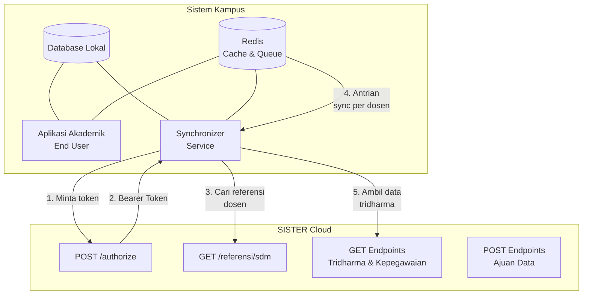
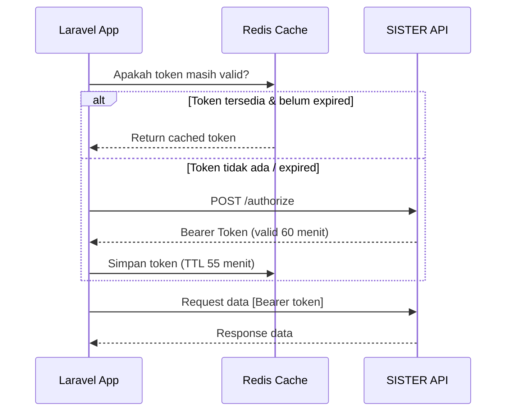
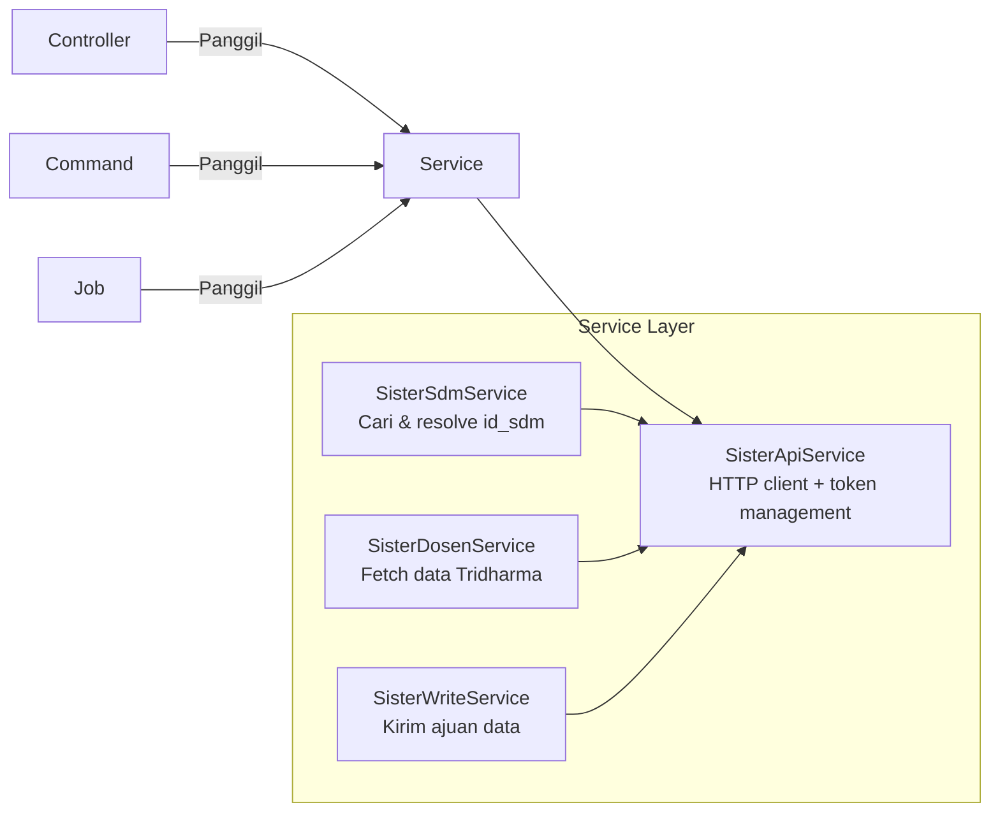
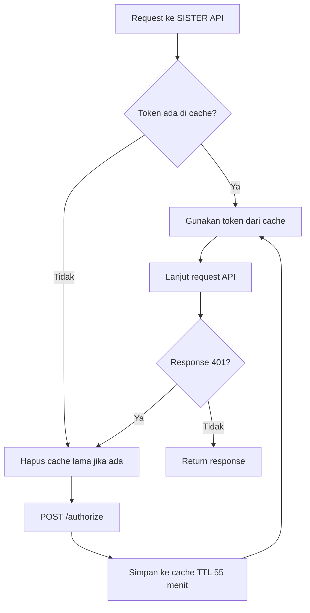
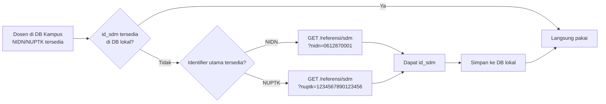
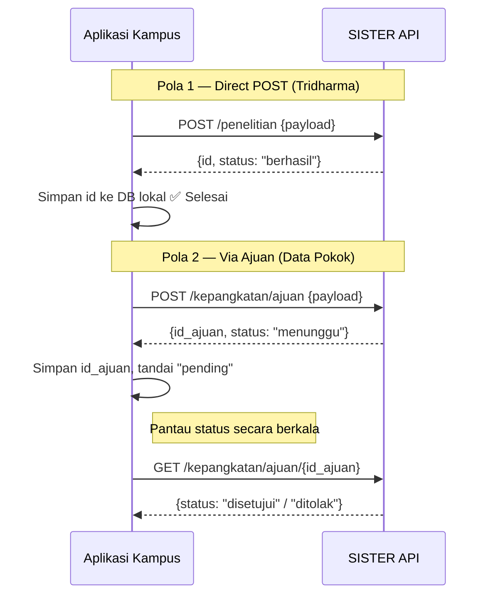
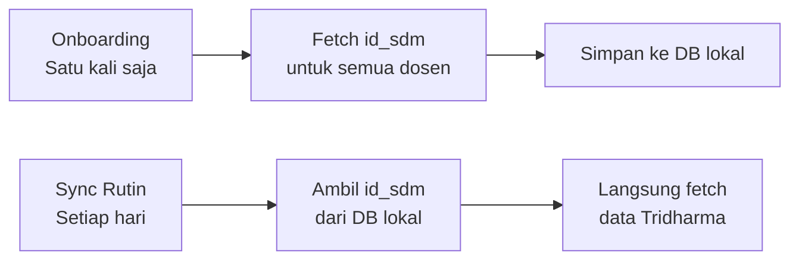
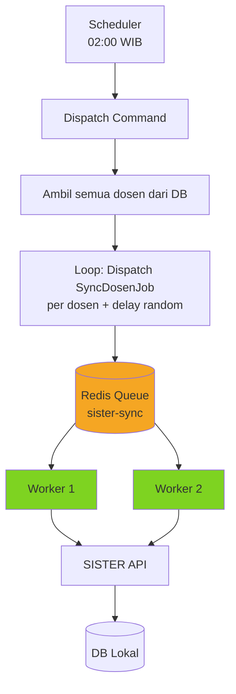
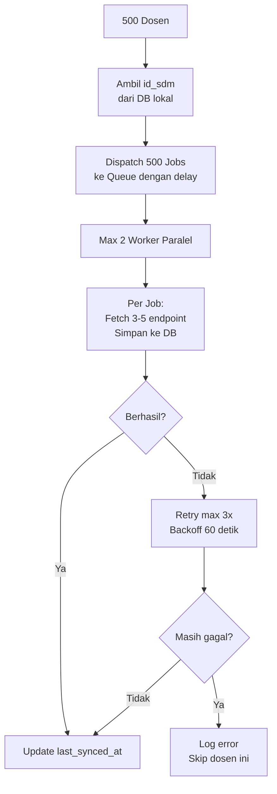

# Integrasi Aplikasi Akademik dengan SISTER API
### Panduan untuk Developer Laravel — Fokus Arsitektur & Strategi

---

## Daftar Isi

1. [Mengenal SISTER & SISTER API](#1-mengenal-sister--sister-api)
2. [Arsitektur & Alur Data](#2-arsitektur--alur-data)
3. [Persiapan Akses & Kredensial](#3-persiapan-akses--kredensial)
4. [Struktur Kode yang Disarankan](#4-struktur-kode-yang-disarankan)
5. [Autentikasi & Manajemen Token](#5-autentikasi--manajemen-token)
6. [Mengambil Data SDM](#6-mengambil-data-sdm)
7. [Menulis Data ke SISTER](#7-menulis-data-ke-sister)
8. [Strategi Bulk Processing](#8-strategi-bulk-processing)
9. [Error Handling & Retry](#9-error-handling--retry)
10. [Best Practices & Checklist](#10-best-practices--checklist)
11. [Referensi Endpoint Lengkap](#11-referensi-endpoint-lengkap)

---

## 1. Mengenal SISTER & SISTER API

**SISTER** (Sistem Informasi Sumber Daya Terintegrasi) adalah platform resmi Kementerian Pendidikan Tinggi, Sains, dan Teknologi untuk mengelola data sumber daya manusia di perguruan tinggi — mulai dari data dosen, penelitian, pengabdian, hingga sertifikasi.

Bayangkan SISTER sebagai _single source of truth_ untuk semua aktivitas Tridharma dosen di Indonesia. Masalahnya, banyak perguruan tinggi sudah punya sistem akademik sendiri yang datanya hidup terpisah. Dosen pun jadi korban: input dua kali di dua sistem yang berbeda. Di sinilah **SISTER API** hadir — jembatan yang memungkinkan sistem kampus dan SISTER berbicara satu sama lain.

### Apa yang Bisa Diintegrasikan?

- Data Kepegawaian (data pokok, kepangkatan, jabatan fungsional)
- Data Tridharma (pengajaran, penelitian, pengabdian)
- Data Publikasi & Kekayaan Intelektual
- Data Sertifikasi Dosen & Profesi
- 30+ jenis data lainnya

### WS Basic vs WS Pro

| Aspek | WS Basic | WS Pro |
|-------|----------|--------|
| Operasi | Read + Write (melalui mekanisme ajuan) | Write langsung tanpa approval kementerian |
| Target pengguna | Perguruan Tinggi (developer aplikasi kampus) | Pengelola PDDikti & SISTER resmi |
| Tingkat approval | Data masuk sebagai pengajuan, perlu verifikasi | Langsung aktif |

Untuk developer aplikasi akademik kampus, **WS Basic sudah lebih dari cukup**.

### Environment

| Environment | Base URL | Fungsi |
|-------------|----------|--------|
| **Sandbox** | `sister-api.kemdiktisaintek.go.id/ws-sandbox.php/1.0` | Pengujian & development |
| **Production** | `sister-api.kemdiktisaintek.go.id/ws.php/1.0` | Data asli, siap pakai |

> **Prinsip pertama:** Selalu develop dan uji di Sandbox. Jangan sentuh Production sebelum semua fitur benar-benar siap.

---

## 2. Arsitektur & Alur Data

### Gambaran Umum Sistem



### Alur Autentikasi per Sesi



### Konsep `id_sdm` — Kunci Utama Semua Data

`id_sdm` adalah identifier internal SISTER untuk setiap SDM. Hampir semua endpoint Tridharma membutuhkan nilai ini sebagai parameter request.

Yang perlu dipahami:
- `id_sdm` **tidak sama** dengan NIDN, NUPTK, atau NIP
- `id_sdm` **bersifat statis** — tidak berubah selama dosen terdaftar di SISTER
- Untuk mendapatkan `id_sdm`, harus memanggil endpoint `/referensi/sdm` terlebih dahulu

Ini menciptakan dependency chain yang harus diperhatikan saat merancang sistem, terutama saat menangani data dalam jumlah besar.

---

## 3. Persiapan Akses & Kredensial

Sebelum baris kode pertama, pastikan ini sudah beres di sisi administrasi.

### Langkah Mendapatkan Akses

**Step 1 — Minta Admin PT mendaftarkan akun**

Admin PT login ke SISTER Cloud, buka **Manajemen Akses**, tambahkan pengguna baru atau edit peran pengguna yang sudah ada dengan peran **"SISTER WS-Basic"**.

**Step 2 — Cek email**

Username dan password dikirim ke email pengguna yang didaftarkan.

**Step 3 — Login & pilih peran yang benar**

Login di [sister.kemdiktisaintek.go.id](https://sister.kemdiktisaintek.go.id). Di beranda, pastikan memilih peran **"SISTER WS-Basic"** — bukan "Developer". Jika terdaftar di dua peran, tetap gunakan WS-Basic.

**Step 4 — Ambil Kredensial API**

Klik tombol **"Kredensial API"**. Akan tersedia tiga nilai yang dibutuhkan:

- `username`
- `password`
- `id_pengguna`

Ketiga nilai ini digunakan untuk request token. Simpan di `.env`, jangan pernah di-hardcode langsung di kode maupun dicommit ke repository.

---

## 4. Struktur Kode yang Disarankan

Sebelum mulai coding, rancang dulu struktur layer di Laravel agar integrasi rapi, mudah diuji, dan mudah dikembangkan.

### Layer Architecture



### Tanggung Jawab Tiap Layer

| Layer | Tanggung Jawab |
|-------|----------------|
| `SisterApiService` | Core HTTP client, manajemen token, retry, error handling |
| `SisterSdmService` | Resolve NIDN/NUPTK/NIP ke `id_sdm`, simpan ke DB lokal |
| `SisterDosenService` | Fetch data Tridharma & kepegawaian per dosen |
| `SisterWriteService` | Kirim ajuan data ke SISTER, pantau status |
| Artisan Command | Trigger sync manual/batch, progress reporting |
| Queue Job | Unit kerja terkecil per dosen, diproses async |
| Scheduler | Trigger otomatis sync rutin |

Pendekatan ini memisahkan HTTP concern dari business logic, memudahkan testing, dan memungkinkan tiap layer diganti atau diextend tanpa merusak yang lain.

---

## 5. Autentikasi & Manajemen Token

### Mekanisme Token

Token didapat dengan mengirim `POST /authorize` menggunakan `username`, `password`, dan `id_pengguna`. Token yang didapat berlaku selama **60 menit**.

### Prinsip Manajemen Token

**Cache dulu, request kemudian.** Selalu cek cache sebelum minta token baru. Token yang masih valid tidak perlu di-request ulang. Gunakan TTL cache **55 menit** (bukan 60) sebagai safety margin agar token tidak expired di tengah request.

**Handle 401 dengan graceful.** Jika server mengembalikan 401 (Unauthorized), artinya token expired lebih cepat dari perkiraan. Solusinya: hapus token dari cache, minta token baru, lalu ulangi request. Ini harus ditangani otomatis di layer `SisterApiService`.

**Jangan simpan token di database.** Token bersifat sementara — tempatnya di cache (Redis), bukan di tabel database.

### Alur Pengambilan Token



---

## 6. Mengambil Data SDM

### Masalah: `id_sdm` Tidak Tersedia Secara Langsung

Saat pertama kali integrasi, sistem kampus biasanya punya NIDN, NUPTK, atau NIP dosen. Untuk fetch data Tridharma, butuh `id_sdm` yang hanya bisa didapat dari endpoint `/referensi/sdm`.

Jangan mengasumsikan semua dosen memiliki NIDN. Dalam praktiknya, ada dosen yang tidak memiliki NIDN tetapi memiliki NUPTK. Karena itu, proses resolve `id_sdm` harus mendukung NIDN dan NUPTK sebagai identifier utama.

### Strategi: Simpan `id_sdm` Lokal, Fetch Sekali Seumur Hidup



`id_sdm` bersifat statis, jadi tidak perlu di-fetch ulang setiap kali sync. Simpan sekali di kolom `id_sdm` pada tabel dosen, gunakan seterusnya. Ini menghemat ratusan hingga ribuan request untuk PT dengan banyak dosen.

### Parameter Pencarian `/referensi/sdm`

| Parameter | Keterangan | Akurasi |
|-----------|------------|---------|
| `nidn` | Nomor Induk Dosen Nasional | ⭐⭐⭐ Paling akurat |
| `nuptk` | Nomor Unik Pendidik dan Tenaga Kependidikan | ⭐⭐⭐ Paling akurat |
| `nip` | NIP (untuk dosen ASN) | ⭐⭐ Akurat jika tersedia dan terisi konsisten |
| `nama` | Nama lengkap (bisa partial) | ⭐⭐ Bisa lebih dari 1 hasil |
| `id_sp` | Kode Perguruan Tinggi | ⭐ Kembalikan semua dosen PT |

Pencarian via `nidn` atau `nuptk` adalah yang paling direkomendasikan karena keduanya dapat menjadi identifier yang sangat akurat per dosen. Gunakan prioritas berikut:

1. Jika `nidn` tersedia, resolve dengan `nidn`.
2. Jika `nidn` kosong tetapi `nuptk` tersedia, resolve dengan `nuptk`.
3. Jika keduanya kosong, gunakan `nip` bila tersedia.
4. Gunakan `nama` hanya sebagai fallback terakhir, dan wajib validasi hasilnya karena bisa mengembalikan lebih dari satu dosen.

---

## 7. Menulis Data ke SISTER

### Dua Pola Write yang Berbeda

Tidak semua endpoint write di SISTER bekerja dengan cara yang sama. Ada dua pola yang perlu dipahami:

**Pola 1 — Direct POST (langsung tersimpan)**

Berlaku untuk mayoritas data Tridharma. Data langsung tersimpan ke SISTER begitu request berhasil — tidak ada tahap verifikasi tambahan.

```
POST /penelitian      → data penelitian langsung masuk
POST /pengabdian      → data pengabdian langsung masuk
POST /publikasi       → data publikasi langsung masuk
POST /bahan_ajar      → langsung masuk
... (mayoritas endpoint Tridharma)
```

**Pola 2 — Via `/ajuan` (perlu verifikasi)**

Berlaku khusus untuk data pokok kepegawaian yang bersifat resmi dan sensitif. Data masuk sebagai pengajuan (_draft_) dan perlu diverifikasi sebelum aktif.

```
POST /data_pribadi/ajuan         → perlu verifikasi
POST /jabatan_fungsional/ajuan   → perlu verifikasi
POST /kepangkatan/ajuan          → perlu verifikasi
POST /pendidikan_formal/ajuan    → perlu verifikasi
POST /sertifikasi_dosen/ajuan    → perlu verifikasi
POST /nilai_tes/ajuan            → perlu verifikasi
```

Logikanya masuk akal: data seperti kepangkatan dan sertifikasi dosen adalah data formal yang tidak bisa langsung diubah sembarang sistem — harus ada approval. Sedangkan data aktivitas Tridharma seperti penelitian dan pengabdian lebih bersifat input portofolio yang bisa langsung masuk.

### Alur Write: Direct POST vs Ajuan



### Batasan: Data yang Tidak Bisa Ditulis via SISTER API

| Jenis Data | Status | Sumber Data |
|------------|--------|-------------|
| Penelitian | ✅ Direct POST | Input kampus/dosen |
| Pengabdian | ✅ Direct POST | Input kampus/dosen |
| Publikasi | ✅ Direct POST | Input manual / tarik SINTA |
| Bahan Ajar, Pembicara, dll | ✅ Direct POST | Input kampus/dosen |
| Data Pribadi, Kepangkatan, dll | ✅ Via `/ajuan` | Input dengan verifikasi |
| **Pengajaran** | ❌ Read only | Dari **PDDikti Feeder** |
| **Bimbingan Mahasiswa** | ❌ Read only | Dari **PDDikti Feeder** |
| **Pengujian Mahasiswa** | ❌ Read only | Dari **PDDikti Feeder** |

Data pengajaran, pembimbingan, dan pengujian mahasiswa bersumber dari pelaporan Neo Feeder ke PDDikti. Tidak bisa ditulis langsung via SISTER API.

### Desain Tabel Sinkronisasi Write

Untuk direct POST, cukup simpan `id` yang dikembalikan SISTER untuk keperluan update/delete nantinya. Untuk endpoint ajuan, perlu tracking status tambahan:

```
tabel: sister_write_log
─────────────────────────────────────────────────────
id
dosen_id          → relasi ke tabel dosen lokal
endpoint          → 'penelitian', 'kepangkatan/ajuan', dll
id_sister         → id record atau id_ajuan yang dikembalikan
payload           → JSON data yang dikirim (audit trail)
pola              → 'direct' | 'ajuan'
status            → 'sukses' | 'menunggu' | 'disetujui' | 'ditolak'
catatan           → pesan error atau alasan penolakan
dikirim_at
diperbarui_at
```

### Verifikasi Schema di Swagger

Karena Swagger SISTER di-render via JavaScript, schema body POST/PUT tidak bisa diakses secara programatik. Cara paling akurat untuk lihat field apa saja yang wajib diisi: **buka langsung di browser**:

```
https://sister-api.kemdikbud.go.id/ws-sandbox.php/1.0
```

Expand tiap endpoint POST, lihat contoh request body dan tipe datanya. Uji langsung di sana sebelum implement di kode.

---

## 8. Strategi Bulk Processing

### Masalah: N+1 Problem di Level API Eksternal

Ini adalah tantangan nyata untuk PT dengan banyak dosen. Kalau dilakukan dengan pendekatan naif — loop biasa tanpa strategi — hasilnya:

| | Jumlah Request |
|-|----------------|
| Resolve `id_sdm` (500 dosen) | 500 request |
| Fetch 3 endpoint Tridharma per dosen | 1.500 request |
| **Total** | **2.000 request** |
| Estimasi durasi (delay 1 detik) | **~33 menit**, satu proses sinkronus |

Risiko nyata dari pendekatan ini: timeout, rate limit tercapai, server SISTER tidak responsif, dan jika proses mati di tengah jalan harus mengulang dari awal.

Pendekatan yang benar membutuhkan tiga lapis strategi.

---

### Lapis 1 — Persisten `id_sdm`, Eliminasi Fetch Berulang

`id_sdm` tidak berubah. Simpan sekali ke database lokal, gunakan seterusnya. 500 request untuk resolve `id_sdm` cukup dilakukan **satu kali saat onboarding** — tidak perlu diulang setiap sesi sync.



Ini mengubah karakteristik sync harian dari 2.000 request menjadi 1.500 request — dan yang lebih penting, tanpa serial dependency "harus fetch SDM dulu setiap kali".

---

### Lapis 2 — Queue-Based Processing, Satu Job per Dosen

Jangan sync ratusan dosen dalam satu proses sinkronus. Pisahkan setiap dosen menjadi satu unit kerja (Job) yang diproses secara asinkron oleh worker.



Keuntungan pendekatan queue:

- **Isolasi kegagalan** — satu dosen gagal tidak mempengaruhi yang lain
- **Retry otomatis** — job yang gagal di-retry secara independen
- **Resumable** — jika server restart, job yang belum diproses tetap ada di queue
- **Paralel terkontrol** — bisa dikonfigurasi berapa worker yang boleh berjalan sekaligus

---

### Lapis 3 — Rate Limiting di Level Worker

SISTER API adalah layanan pemerintah, bukan cloud infinitely scalable. Pastikan jumlah request yang dikirim dalam satu waktu tidak berlebihan.

**Batasi jumlah worker paralel.** Untuk queue `sister-sync`, cukup gunakan 2 worker — artinya maksimal 2 request berjalan secara bersamaan ke SISTER API.

**Tambahkan delay antar dispatch.** Saat mendispatch job, tambahkan delay random kecil (1–5 detik) antar job agar tidak semua job dieksekusi dalam satu burst di awal.

**Gunakan backoff saat retry.** Jika job gagal, jangan langsung retry. Berikan jeda yang semakin panjang (exponential backoff) untuk memberi waktu SISTER API recover.

```mermaid
gantt
    title Distribusi Request ke SISTER API (500 dosen, 2 worker)
    dateFormat HH:mm
    axisFormat %H:%M

    section Worker 1
    Batch 1 (dosen 1-250)   :02:00, 4h

    section Worker 2
    Batch 2 (dosen 251-500) :02:00, 4h
```



Dengan 2 worker, 3 endpoint per dosen, dan jeda 1 detik, 500 dosen selesai dalam sekitar 4 jam — cukup untuk window malam hari tanpa mengganggu jam operasional.

---

### Perbandingan Pendekatan

| | Naif (Loop Sinkronus) | Queue-Based |
|--|-----------------------|-------------|
| Durasi | ~33 menit, satu proses | ~4 jam, paralel terkontrol |
| Jika gagal di tengah | Harus ulang dari awal | Hanya job yang gagal yang di-retry |
| Beban server app | Tinggi (proses PHP tidak berakhir) | Rendah (handled worker) |
| Bisa di-scale | ❌ | ✅ Tambah worker jika butuh |
| Monitoring | Sulit | Mudah via Horizon / log |

---

### Alur Lengkap Bulk Sync



---

## 9. Error Handling & Retry

### Jenis Error yang Mungkin Terjadi

| Error | Penyebab | Penanganan |
|-------|----------|------------|
| `401 Unauthorized` | Token expired | Hapus cache, fetch token baru, retry request |
| `404 Not Found` | `id_sdm` tidak valid | Log warning, skip dosen ini |
| `429 Too Many Requests` | Rate limit tercapai | Retry dengan exponential backoff |
| `5xx Server Error` | Masalah di sisi SISTER | Retry, jika terus gagal skip dan log |
| Connection Timeout | SISTER API lambat/down | Retry, set timeout wajar (30 detik) |

### Strategi Retry

Retry hanya untuk:
- Error 5xx (server error — bukan kesalahan request kita)
- Connection timeout / network error
- 429 Too Many Requests

Jangan retry untuk:
- Error 4xx selain 401 dan 429 (request yang memang salah)
- 401 yang sudah dihandled dengan token refresh

### Prinsip "Fail Gracefully"

Dalam context sync batch, kegagalan satu dosen **tidak boleh menghentikan proses keseluruhan**. Setiap job harus wrapped dalam error handling yang proper: jika gagal, log detailnya, tandai sebagai failed, dan lanjut ke dosen berikutnya.

Sediakan mekanisme untuk melihat dosen mana saja yang gagal di-sync, sehingga bisa di-retry secara manual atau dijadwalkan ulang.

---

## 10. Best Practices & Checklist

### Prinsip Utama

**1. Lokal dulu, API kemudian.**
Jangan real-time call ke SISTER untuk menampilkan data ke user. Sync ke database lokal, tampilkan dari lokal. SISTER API bukan CDN — latency-nya tidak cocok untuk serving data ke banyak pengguna sekaligus.

**2. `id_sdm` adalah aset, perlakukan seperti itu.**
Simpan di database, backup. Kehilangan mapping `id_sdm` berarti harus fetch ulang untuk semua dosen.

**3. SISTER API bukan milik kita.**
Perlakukan dengan sopan: jangan spam, jangan burst, beri jeda. Ini layanan pemerintah yang digunakan ratusan PT se-Indonesia.

**4. Pahami perbedaan Direct POST vs Ajuan.**
Mayoritas data Tridharma (penelitian, pengabdian, publikasi, dll) bisa langsung `POST` dan langsung tersimpan. Hanya data pokok kepegawaian tertentu (kepangkatan, jabatan fungsional, sertifikasi dosen, dll) yang melalui mekanisme `/ajuan` dan perlu verifikasi. Rancang UI-nya sesuai: jangan tampilkan "menunggu verifikasi" untuk data yang sebenarnya langsung aktif.

**5. Token ≠ Password.**
Token sifatnya ephemeral — simpan di cache Redis. Credentials sifatnya permanen — simpan di `.env` yang di-gitignore, jangan masuk repository.

**6. Data pengajaran dari Feeder, bukan dari SISTER API.**
Jika sistem kampus sudah terintegrasi dengan Neo Feeder PDDikti, data pengajaran sudah ada jalurnya sendiri. Jangan mencoba write data pengajaran ke SISTER via API.

### Do's & Don'ts

**✅ Lakukan:**
- Uji di Sandbox sebelum Production
- Cache token dengan TTL 55 menit
- Simpan `id_sdm` lokal setelah pertama kali resolve
- Gunakan Queue untuk sync lebih dari ~10 dosen
- Log semua error dengan context lengkap (endpoint, id_sdm, response body)
- Pantau status ajuan secara berkala
- Buka Swagger UI langsung di browser untuk verifikasi schema write

**❌ Hindari:**
- Hardcode credentials di source code
- Loop sinkronus untuk batch besar
- Real-time call ke SISTER untuk serving UI
- Request paralel ke SISTER tanpa batas
- Asumsikan data ajuan langsung aktif
- Mencoba write data pengajaran/bimbingan/pengujian via API
- Menggunakan peran "Developer" untuk implementasi

### Checklist Sebelum Go Live

```
[ ] Environment sudah ganti ke Production URL
[ ] Credentials production ada di .env (tidak di-commit ke repo)
[ ] Cache driver sudah Redis (bukan file)
[ ] Queue driver sudah Redis/DB (bukan sync)
[ ] Queue worker sudah running di server
[ ] Scheduler sudah dikonfigurasi untuk sync rutin
[ ] Error logging terpasang dan bisa dimonitor
[ ] Tabel tracking ajuan sudah ada (untuk fitur write)
[ ] id_sdm semua dosen sudah tersimpan di DB lokal (seed awal)
[ ] Jumlah worker paralel sudah dibatasi (max 2 untuk sister-sync)
[ ] Mekanisme retry dan dead-letter sudah diuji
[ ] Data backup sebelum pertama kali sync ke production
```

---

## 11. Referensi Endpoint Lengkap

Semua endpoint read menggunakan method **GET**. Endpoint write menggunakan **POST** atau **PUT** ke path `/[resource]/ajuan`. Semua request kecuali `/authorize` wajib menyertakan header `Authorization: Bearer {token}`.

> Untuk schema body lengkap endpoint write (POST/PUT), verifikasi langsung di Swagger UI:
> `https://sister-api.kemdikbud.go.id/ws-sandbox.php/1.0`

### Autentikasi & Referensi

| Method | Endpoint | Parameter |
|--------|----------|-----------|
| POST | `/authorize` | `username`, `password`, `id_pengguna` |
| GET | `/referensi/sdm` | `id_sp`, `nama`, `nidn`, `nuptk`, `nip` |

### Data Kepegawaian

Semua endpoint berikut menggunakan `id_sdm` sebagai parameter utama.

| Endpoint | Deskripsi |
|----------|-----------|
| `GET /data_pribadi/ajuan` | Data pokok dosen |
| `GET /dokumen` | Dokumen dosen |
| `GET /jabatan_fungsional` | Riwayat jabatan fungsional |
| `GET /kepangkatan` | Riwayat kepangkatan |
| `GET /inpassing` | Data inpassing |
| `GET /penugasan` | Data penugasan |
| `GET /tugas_tambahan` | Tugas tambahan |
| `GET /jabatan_struktural` | Jabatan struktural |
| `GET /sertifikasi_dosen` | Sertifikasi dosen (serdos) |
| `GET /sertifikasi_profesi` | Sertifikat profesi |
| `GET /pendidikan_formal` | Riwayat pendidikan formal |
| `GET /diklat` | Pelatihan/diklat |
| `GET /riwayat_pekerjaan` | Riwayat pekerjaan |
| `GET /beasiswa` | Riwayat beasiswa |
| `GET /kesejahteraan` | Data kesejahteraan |
| `GET /tunjangan` | Data tunjangan |

### Data Tridharma — Pengajaran _(Read Only via API)_

> Sumber data dari **PDDikti Feeder**. Tidak bisa ditulis langsung via SISTER API.

| Endpoint | Deskripsi |
|----------|-----------|
| `GET /pengajaran` | Data pengajaran per semester |
| `GET /bimbingan_mahasiswa` | Bimbingan mahasiswa |
| `GET /pengujian_mahasiswa` | Pengujian/sidang mahasiswa |
| `GET /bimbing_dosen` | Bimbingan antar dosen |
| `GET /detasering` | Data detasering |
| `GET /orasi_ilmiah` | Orasi ilmiah |

### Data Tridharma — Penelitian & Pengabdian _(Read & Direct POST)_

> Data berikut dapat ditulis langsung ke SISTER via `POST` — tidak memerlukan mekanisme ajuan, data langsung tersimpan.

| Endpoint | Deskripsi |
|----------|-----------|
| `GET/POST /penelitian` | Data penelitian |
| `GET/POST /publikasi` | Publikasi ilmiah |
| `GET/POST /kekayaan_intelektual` | HAKI, paten, dll |
| `GET/POST /bahan_ajar` | Bahan ajar yang dibuat |
| `GET/POST /pengabdian` | Pengabdian masyarakat |
| `GET/POST /pembicara` | Sebagai pembicara/narasumber |
| `GET/POST /anggota_profesi` | Keanggotaan organisasi profesi |
| `GET/POST /pengelola_jurnal` | Pengelola jurnal ilmiah |
| `GET/POST /penghargaan` | Penghargaan yang diterima |
| `GET/POST /visiting_scientist` | Program visiting scientist |
| `GET/POST /penunjang_lain` | Kegiatan penunjang lainnya |
| `GET/POST /diklat` | Pelatihan/diklat |
| `GET/POST /riwayat_pekerjaan` | Riwayat pekerjaan |
| `GET/POST /sertifikasi_profesi` | Sertifikat profesi |
| `GET/POST /beasiswa` | Riwayat beasiswa |
| `GET/POST /kesejahteraan` | Data kesejahteraan |
| `GET/POST /tunjangan` | Data tunjangan |

### Data Pokok Kepegawaian _(Write via `/ajuan`)_

> Data berikut bersifat formal dan sensitif — write-nya melalui sub-endpoint `/ajuan` dan memerlukan verifikasi sebelum aktif.

| Endpoint | Deskripsi |
|----------|-----------|
| `POST /data_pribadi/ajuan` | Pengajuan perubahan data pokok |
| `GET/POST /jabatan_fungsional/ajuan` | Pengajuan jabatan fungsional |
| `GET/POST /kepangkatan/ajuan` | Pengajuan kepangkatan |
| `GET/POST /pendidikan_formal/ajuan` | Pengajuan riwayat pendidikan formal |
| `GET/POST /sertifikasi_dosen/ajuan` | Pengajuan sertifikasi dosen |
| `GET/POST /nilai_tes/ajuan` | Pengajuan nilai tes |

---

## Penutup

Integrasi SISTER API bukan sekadar soal bisa atau tidaknya memanggil HTTP endpoint. Yang lebih penting adalah memahami konteksnya: data mana yang bisa ditulis, data mana yang tidak, bagaimana alur verifikasi bekerja, dan bagaimana menangani ratusan dosen tanpa membebani sistem sendiri maupun server SISTER.

Tiga hal yang membedakan implementasi yang baik dari yang buruk:

1. **Arsitektur yang tepat** — layer yang jelas, dependency yang terkontrol
2. **Respek terhadap rate limit** — queue, delay, jumlah worker terbatas
3. **Pemahaman tentang ajuan** — write bukan berarti langsung aktif

Mulai dari yang paling dibutuhkan, uji di Sandbox sampai yakin, baru masuk Production.

**Referensi resmi:**
- Panduan API SISTER: https://sister.kemdiktisaintek.go.id/pusat_informasi/detail/21829793658649
- Dokumentasi API (Swagger UI): https://sister-api.kemdiktisaintek.go.id/ws.php/1.0

---

*Dokumen ini disusun berdasarkan dokumentasi resmi SISTER API versi Cloud. Selalu cek dokumentasi resmi untuk pembaruan terbaru.*
